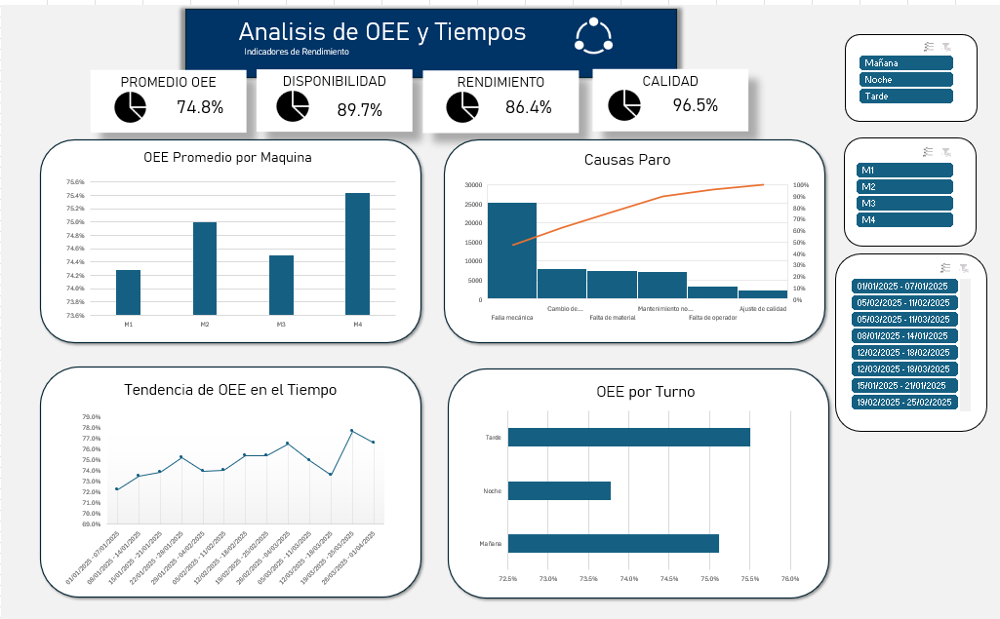

# Análisis de OEE y Tiempos Muertos-Línea de Producción
Proyecto de análisis de datos de punta a punta enfocado en manufactura: desde datos sintéticos generados en Python hasta un dashboard interactivo en Excel, pasando por SQL para almacenamiento y consulta.
**Stack:** Python(pandas, numpy), MySQL, Excel(tablas dinamicas, segmentadores, grafico de Pareto)

---

## El problema de negocio

Una planta de manufactura con 4 maquinas operando en 3 turnos quiere entender:
-¿Que tan eficiente es realmente la linea de producción (OEE)?
-¿Cuales son la principales causas de tiempo muerto?
-¿Hay diferencias de desempeño entre maquinas o turnos?
-¿Donde deberia enfocar sus esfuerzos de mejora continua para el mayor impacto?

## La Informacion

No existe un data set público que traiga la estructura necesaria para calcular OEE real (tiempo planeado, tiempo de paro por causa, piezas buenas/defectuosas), por eso se **genero un dataset sintetico con Python** (`generar_datos.py`), simulando 90 dias produccion en 4 maquinas por 3 turnos, con causas de paro ralista y distintas probabilidades/duraciones (falla mecanica, cambio de herramienta, falta de material, ajuste de calidad, falta de operador, mantenimiento no programado).
Esto produce dos tablas relacionadas:
- `produccion.csv` un renglon por maquina, turno dia (piezas producidas, buenas, defectuosas, tiempo muerto total)
- `paros.csv` un renglon por cada evento de paro individual, con su causa y duracion

## Proceso

### 1.Generacion de datos(Python)
`generar_datos.py` simula la operación con `numpy.random`(distribucion de Poisson para numero de paros, exponencial para su duracion), dando un dataset realista y reproducible.

### 2.Base de datos (SQL)
Los datos se cargan a MySQL (`cargar_datos_oee.py`) en dos tablas relacionadas por `Registro_ID` (foreign key), y se exploran con SQL (`consultas_oee.sql`): tiempo muerto por maquina, tasa de defecto y un primer acercamiento a las causas de paro mas frecuentes.

### 3.Calculo de OEE (Python)
`analisis_oee.py` calcula las tres componentes clasicas del OEE:

```

Disponibilidad = Tiempo Operativo / Tiempo Planeado
Rendimiento = (Ciclo ideal * Piezas Producidas) / (Tiempo Operativo en segundos)
Calidad = Piezas Buenas/ Piezas Producidas
OEE = Disponibilidad * Rendimiento * Calidad

```

Se exportan los datos enriquecidos (`produccion_oee.csv`, `paros_export.csv`) listos para Excel.

### 4.Dashboard
Tablas dinámicas y segmentadores conectados para OEE por máquina, por turno y su tendencia semanal, más un gráfico de Pareto nativo de Excel para las causas de tiempo muerto



---

## Hallazgos clave

### 1.OEE general: 74.8%
| Metrica | Valor |
|---|---|
| OEE | **74.8%** |
| Disponibilidad | 89.7% |
| Rendimiento | 86.4% |
| Calidad | 96.5% |

Por debajo del estándar de "clase mundial" (85%), pero por encima del típico de la industrial (-60%). El comportamiento con más margen de mejora es **Rendimiento** (86.4), seguido de Disponibilidad.

### 2. Desempeño consistente entre maquinas
| Maquina | OEE Promedio |
|---|---|
| M1 | 74.3% |
| M2 | 75.0% |
| M3 | 74.5% |
| M4 | 75.4% |

La poca variación entre maquinas (menos de 1.1 puntos porcentuales) indica que el problema **no está concentrado en una maquina especifica** --las mejoras deben apuntar a causas sistémicas de la línea completa, no a intervenciones puntuales en un equipo.

### 3. Dos causas explican la mayoría del tiempo muerto
El análisis de Pareto sobre los eventos de paro muestra que **Falla mecánica** y **Cambio de herramienta**, juntas concentran aproximadamente el 70%-75% del tiempo muerto total, mientras que las otras 4 causas (falta de material, ajuste de calidad, falta de operador, mantenimiento no programado) se reparten el resto.

**Recomendación de negocio:** priorizar un programa de mantenimiento preventivo enfocado en fallas mecánicas y optimizar el procedimiento de cambio de herramienta (ej. metodología SMED), antes que dispersar esfuerzos en las seis causas por igual, es donde está la mayor palanca de mejora del OEE general.

---

## Estructura del repositorio

```
|---generar_datos.py---Simulación de datos de producción y paros
|---cargar_datos_oee.py---Carga a MySQL (tablas relacionadas)
|---consultas_oee.sql---Exploración inicial en SQL
|---analisis_oee.py---Calculo de OEE y exportacion
|---prodcuccion.csv---Datos originales generados
|---paros.csv
|---produccion_oee.csv---Datos con OEE calculado (para Excel)
|---paros_export.csv
|---dashboard_oee.xlsx---Dashboard interactivo en Excel
|---dashboard_excel.png
|---README.md

```

## Como reproducirlo
1.Generar los datos: `python generar_datos.py`
2.Crear la base `portafolio_oee` en MySQL y cargar los datos: `python cargar_datos_oee.py`
3.Calcular OEE y exportar: `python analisis_oee.py`
4.Abrir `dashboard_oee.xlsx` en Excel, o reconstruir el dashboard importando los CSV finales
